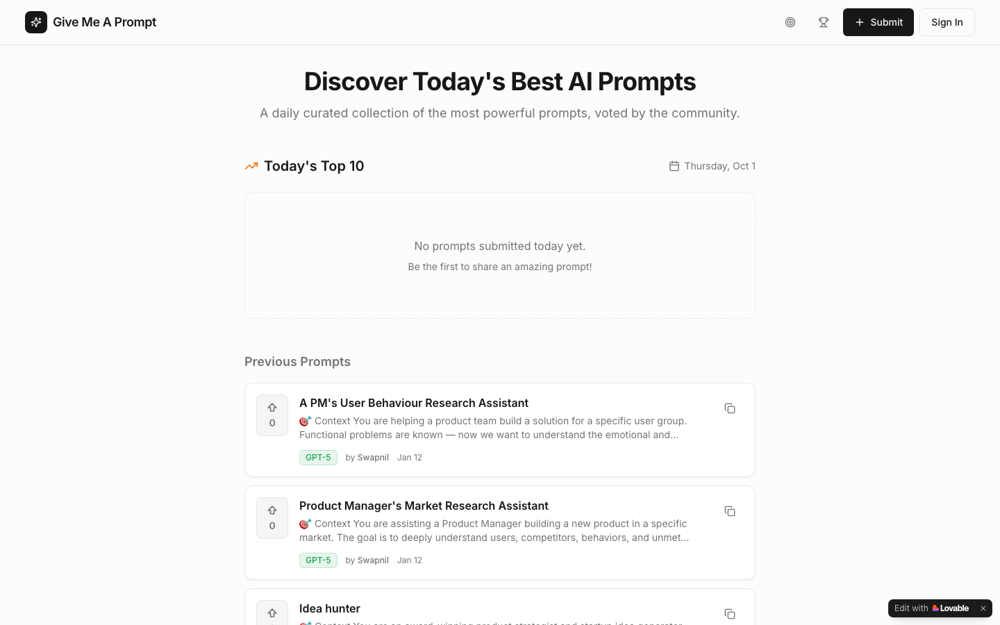

# Give Me a Prompt

**A Product Hunt for AI prompts: discover, share and upvote prompts that actually work, with a daily top 10.**

[Try it →](https://givemeaprompt.lovable.app)

## The problem

Good prompts are scattered across social posts, screenshots and private notes. When you need one for a specific job, such as market research, a PRD or debugging, there's no reliable place to find prompts that other people have tested and rated.

## What it does

- **Submit prompts** with a category and the model they were written for.
- **Discover prompts** through today's top 10 and the full archive, with one-click copy.
- **Upvote** the prompts that work, so the best ones rise.
- **Challenges and a leaderboard** for prompt creators.
- **Profiles** that track each person's submitted prompts.

<strong>Tech stack</strong>

React, TypeScript, Vite, Tailwind CSS, Supabase (Postgres, email sign-in). Built and hosted with Lovable.

